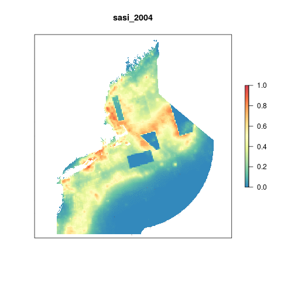

# Summary
This script creates the offshore habitat data layer for the Habitats goal (a sub-goal of Biodiversity). 

# Data

SASI

# Setup

```{r setup, message = F, warning = F}
knitr::opts_chunk$set(fig.width = 6, fig.height = 4, fig.path = 'figs/',
                      echo = TRUE, message = FALSE, warning = FALSE)

source('~/github/ne-prep/src/R/common.R')

library(animation)
```

# Data Cleaning

## Load SASI data

Load and crop to our region

```{r sasi_raw}
sasi_raw <- read_sf(file.path(dir_anx, "_raw_data/SASI/disturbProps_allGear_20181018/disturbProps_allGear_20181018.shp")) 

plot(sasi_raw[10], border = NA)
```

Clean up by cropping to our region, and averaging SASI per year.
```{r, eval = F}
sasi2 <- sasi_raw %>%
  select(c(1, 99:267)) #gives us 2004 - 2017

for(i in 2:ncol(sasi2)){
  
  data <- sasi2 %>%
    select(1,i)
  
  ras <- fasterize::fasterize(st_collection_extract(data, "POLYGON"), ocean_ne, field = colnames(data)[2])
  
  writeRaster(ras, filename = paste0(dir_anx, "/hab/sasi/", colnames(data)[2], ".tif"), overwrite = T)
  
}
```

# Calculate layer

## Average annual SASI rasters

Calculate average annual rasters for SASI

```{r, eval = F}
files <- list.files(file.path(dir_anx, "hab/sasi"), full.names = T)

for(i in 2004:2017){
  
  f <- files[str_detect(files, as.character(i))]
  
  sasi_yr <- stack(f) %>%
    mean(na.rm = T)
  
  writeRaster(sasi_yr, filename = paste0("data/rasters/sasi_", i, ".tif"), overwrite = T)
}
```

## Animate

Create yearly gif for data visualization purposes.

```{r annual_gif}
annual_files <- list.files("data/rasters", full.names = T)

# s <- stack(annual_files)
# 
# saveGIF({
#   for(i in 1:nlayers(s)){
#       # don't forget to fix the zlimits
#       plot(s[[i]], zlim=c(0,1), axes=F, col=cols,
#            main=names(s[[i]]))
#       
#   }
# }, movie.name = 'sasi.gif')
```



## Get regional average SASI scores

```{r}

rgn_sasi_out <- data.frame()

for(i in 2004:2017){
  
  f <- raster(annual_files[str_detect(annual_files, as.character(i))])
  
  #overlay rgns and calculate average
  
  rgn_sasi <- raster::zonal(f, zones, fun = "mean") %>%
    as.data.frame() %>%
    mutate(year = i) %>%
    rename(rgn_id = zone,
           sasi   = mean)
  
  rgn_sasi_out <- rbind(rgn_sasi_out, rgn_sasi)
  
}
```

# Results

High impact scores should result in lower OHI scores so here we subtract SASI values from 1

```{r plot}

rgn_sasi_scores <- rgn_sasi_out %>%
  mutate(score = 1-sasi,
         habitat = "seabed") %>% #invert scores so high impact = low score
  left_join(rgn_data) %>%
  select(-area_km2, -state)

ggplot(rgn_sasi_scores, aes(x = year, y = score, color = rgn_name)) +
  geom_line() +
  theme_bw() +
  labs(x = "Year",
       y = "Layer Score",
       title = "Offshore Habitat")

```


# Save layer for toolbox

I need to attach region ID's to each row. I also add the offshore regions 1:4 with NA values for the toolbox to run. 

```{r save_layer}
write_csv(rgn_sasi_scores, "~/github/ne-scores/region/layers/hab_sasi.csv")
```

We also use the SASI data as a pressure. The higher the impact the higher the pressure so we don't inverse scores for this layer.

```{r}
rgn_sasi_prs <- rgn_sasi_out %>%
  mutate(score = sasi) %>% #invert scores so high impact = low score
  left_join(rgn_data) %>%
  select(-area_km2, -state) 


write_csv(rgn_sasi_prs, "~/github/ne-scores/region/layers/hd_subtidal.csv")
```


