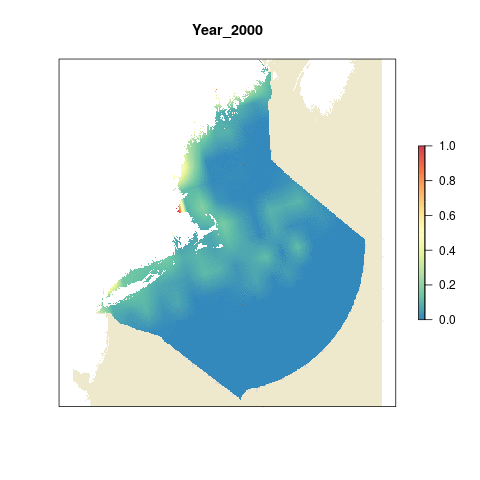

``` {r setup,  message = FALSE, warning = FALSE}
knitr::opts_chunk$set(fig.width = 6, fig.height = 4, fig.path = 'figs/',
                      message = FALSE, warning = FALSE)

source('~/github/ne-prep/src/R/common.R')

#libraries
library(raster)
library(readxl)
library(animation)
```

# Summary

The fishing pressure layer represents the total amount of biomass removed by fishing through landings and bycatch. Total biomass per half-degree cell within the Northeast is calculated for each year 2000 - 2015, then rescaled using the 99.9th quantile across the time series and region. This ends up being 43 tons/km2.

***

# Data Source

**Reference**: Watson, R. A. and Tidd, A. 2018. Mapping nearly a century and a half of global marine fishing: 1869–2015. Marine Policy, 93, pp. 171-177. [(Paper URL)](https://doi.org/10.1016/j.marpol.2018.04.023)

**Downloaded**: July 3, 2019 from [IMAS portal](http://data.imas.utas.edu.au/portal/search?uuid=ff1274e1-c0ab-411b-a8a2-5a12eb27f2c0) - click on download tab, step 3

**Description**:  Global fisheries landings data per cell separated by Industrial versus Non-Industrial catch, IUU, and discards.

**Native data resolution**:   

**Time range**: 1950 - 2015

**Format**:  CSV format

**Additional Information**: [Metadata](http://metadata.imas.utas.edu.au/geonetwork/srv/eng/metadata.show), [Supplementary Material](https://ars.els-cdn.com/content/image/1-s2.0-S0308597X18300605-mmc1.docx)


***
  
# Load data

The Watson fishing data is held on Mazu for the global OHI. 

```{r}
#list all files in the watson raw data folder
files <- list.files(file.path(dir_M, "git-annex/globalprep/_raw_data/IMAS_GlobalFisheriesLandings/d2019"), full.names = T)
```

We want the industrial and non-industrial catch from 2000 onwards.

```{r}
all_files <- files[str_detect(files, paste(c("2000_2004", "2005_2009", "2010_2014", "2015_2015"), collapse = '|'))]
```

Load `.rds` files

```{r load_rds_files}
index_ind  <- read_csv(file.path(dir_M, "git-annex/globalprep/_raw_data/IMAS_GlobalFisheriesLandings/d2019/IndexInd.csv"))
index_nind <- read_csv(file.path(dir_M, "git-annex/globalprep/_raw_data/IMAS_GlobalFisheriesLandings/d2019/IndexNInd.csv"))
cells      <- read_excel(path = file.path(dir_M, "git-annex/globalprep/_raw_data/IMAS_GlobalFisheriesLandings/d2019/Codes.xlsx"), sheet = "Cell") 
```


### Get Northeast cells

We don't need all data, just the data for our region. Using the cells information, crop it to our region of interest and keep a vector of `ne_cells` to use for querying data.

```{r get_ne_cells}
cells_raster <- cells %>%
  rename(x = LonCentre, y = LatCentre, z = Cell) %>% #I renamed these xyz to use in the rasterFromXYZ() function below
  select(x,y,z) %>%
  rasterFromXYZ() %>%
  crop(wgs_ext)

#need to set CRS
crs(cells_raster) <- "+proj=longlat +datum=WGS84 +no_defs +ellps=WGS84 +towgs84=0,0,0" 

plot(cells_raster)

ne_cells <- getValues(cells_raster)

#vector of all cell ids in our region of interest
ne_cell_ids <- ne_cells[!is.na(ne_cells)]
```


Tidy Fisheries Files:
1. Combine the Master Index and Spatial Cells with the CatchInd and CatchNInd files.
2. Save each year of data as a separate file into: "globalprep/prs_fish/v2019/int/annual_catch"

**Function for Combining & Saving Files**: Create function to read in each file name, combine with Index and Cells data frame, and save each year of catch data into a separate file in mazu.

```{r tidy, eval=FALSE}
## Set function to read in each file, combine with Index.csv and Cells.csv, and save each year of data back into mazu
combine_fis <- function(x) {
  #x <- all_files[1]
 
  #get the right index file depending on industrial or non industrial
 if(str_detect(basename(x), "CatchInd")){
    index <- index_ind
  }else{
    index <- index_nind
  }
  
  ## Read in the catch data
  ## Create a total Landings column
  ## Join with master and spatial cells file
  df <- readRDS(x) %>%
    dplyr::filter(Cell %in% ne_cell_ids) %>%
    dplyr::mutate(Catch = Reported+IUU+Discards) %>% 
    dplyr::left_join(index, by = "ID") %>% 
    select(ID, Cell, Catch, Year = IYear) %>%
    left_join(cells) %>%
    mutate(tons_per_km = Catch/OceanAreasqkm)
  
  ## Save each individual year as a single file
  five_years <- sort(unique(df$Year)) 
  
  for(yr in five_years){
    print(yr) # will show you your progress
    #yr = 2014
    single_yr_df <- df %>%
      filter(Year == yr)
    
    ## Save files with prefix CatchInd or CatchNInd
    ## Remove the suffix starting with '_' to get CatchInd or CatchNInd
    ind_Nind <- basename(x) %>% 
      tools::file_path_sans_ext() %>% 
      str_remove("d.*") # remove everything after the first underscore
    
    write_csv(single_yr_df, paste0(dir_anx, "/prs_fish/data/", ind_Nind, "d_", yr, ".csv"))
    
  }
}

# apply to all files

map(all_files, combine_fis)
```

Create annual catch raster layers by combining landings and discards (for total biomass removal) from both non-industrial and industrial fishing.

```{r, results = "hide"}
make_catch_rasters <- function(year){
  
  ind  <- read_csv(paste0(dir_anx, "/prs_fish/data/CatchInd_", year, ".csv"))
  nind <- read_csv(paste0(dir_anx, "/prs_fish/data/CatchNInd_", year, ".csv"))
  
  both <- bind_rows(ind, nind) %>%
    group_by(Cell) %>%
    summarize(total_catch = sum(tons_per_km))
  
  #subs cells_raster with landings and bycatch
  #reproject & resample to 1km (the catch is already at 1 km - in Version 4.0 it comes as tons but above we calculated per km2)
  catch_rast <- subs(cells_raster, both, by = "Cell", which = "total_catch") %>%
    projectRaster(ocean_ne) %>%
    resample(ocean_ne) %>%
    mask(zones)

  writeRaster(catch_rast, filename = paste0(dir_anx, "/prs_fish/data/catch_", year, ".tif"), overwrite = T)
}

#apply to all years

map(c(2000:2015), make_catch_rasters)
```

# Make gif for catch over time

```{r gif}

catch_rasts <- list.files(file.path(dir_anx, 'prs_fish/data'), full.names = T, pattern = "^catch_") %>%
                           stack()
                         
names(catch_rasts) <- paste0("Year_", substr(names(catch_rasts),7,10))
animation::saveGIF({
  for(i in 1:nlayers(catch_rasts)){
     plot(ocean_ne,col='cornsilk2',  main=names(catch_rasts[[i]]),axes=F,legend=F)
      # don't forget to fix the zlimits
    plot(catch_rasts[[i]],axes=F, col=cols, add=T)
      
  }
}, movie.name = 'catch_over_time.gif')
```


# Get reference point

We will use the 99.9th quantile to rescale (42.9 tons/km2)

```{r reference_point}
#landings
all_vals <- getValues(catch_rasts)

hist(all_vals, breaks = 25)
catch_ref  <- quantile(all_vals, na.rm = T, probs = 0.999)
```

# Rescale between 0 and 1

```{r rescale, results = "hide"}

rescale_rasts <- function(year){
  
  r <- raster(paste0(dir_anx, "/prs_fish/data/catch_", year, ".tif"))
  
  rescaled_r <- r/catch_ref
  
  rescaled_r[rescaled_r>1] <- 1
  
  writeRaster(rescaled_r, filename = paste0(dir_anx, "/prs_fish/data/rescaled_catch_", year, ".tif"), overwrite = T)
}

map(c(2000:2015), rescale_rasts)
```

# Make gif of rescaled catch

```{r rescaled_gif}

catch_rasts <- list.files(file.path(dir_anx, 'prs_fish/data'), full.names = T, pattern = "rescaled_catch_") %>%
                           stack()
                         
names(catch_rasts) <- paste0("Year_", substr(names(catch_rasts),16,19))
animation::saveGIF({
  for(i in 1:nlayers(catch_rasts)){
     plot(ocean_ne,col='cornsilk2',  main=names(catch_rasts[[i]]),axes=F,legend=F)
      # don't forget to fix the zlimits
    plot(catch_rasts[[i]], zlim=c(0,1), axes=F, col=cols, add=T)
      
  }
}, movie.name = 'rescaled_catch_over_time.gif')
```



# Run zonal statistics for each ohi region

Stack each year then run `zonal` statistics to get the mean pressure score for each OHI region and year.

```{r zonal_stats}
catch_stack <- list.files(file.path(dir_anx, "prs_fish/data/"), pattern = "rescaled_catch_", full.names = T) %>% stack()
catch_rgns     <- zonal(catch_stack, zones) %>% #zonal's default statistic is to take the mean
  as.data.frame() %>%
  gather(key = "year", value = "pressure_score", -zone) %>%
  mutate(year = as.numeric(str_replace(year, "rescaled_catch_", ""))) %>%
  rename(rgn_id = zone) %>%
  left_join(rgn_data, by = "rgn_id") %>%
  select(-area_km2, -state_name, -state, -state_abv)

#get zonal for the entire region
rgn_12_zones <- raster("~/github/ne-prep/spatial/ocean_rasters/rgn_12_zone.tif")
catch_ne <- zonal(catch_stack, rgn_12_zones) %>% #zonal's default statistic is to take the mean
  as.data.frame() %>%
  gather(key = "year", value = "pressure_score", -zone) %>%
  mutate(year = as.numeric(str_replace(year, "rescaled_catch_", ""))) %>%
  rename(rgn_id = zone) %>%
  mutate(rgn_name = "Northeast") 
  
catch_z <- bind_rows(catch_rgns, catch_ne)
```

# Pressure scores

```{r}
ggplot(catch_z, aes(x = year, y = pressure_score, color = rgn_name)) +
  geom_line() +
  theme_bw()
```


# Save to toolbox

```{r}
write_csv(catch_z, "~/github/ne-scores/region/layers/prs_fishing.csv")
```


***
