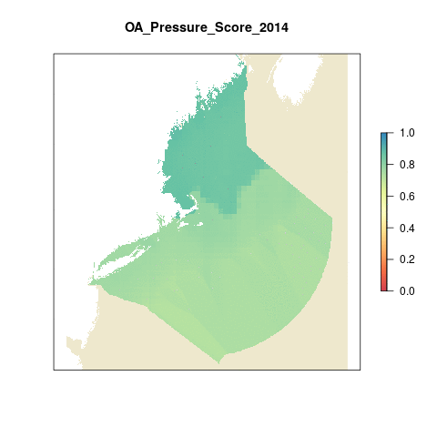
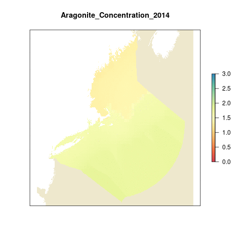

# Summary

This script calculates the ocean acidification pressure layer derived from [NOAA's East Coast Ocean Acidification Product Suite](https://www.coral.noaa.gov/accrete/east-coast-oaps.html).

# Data:

Source: [East Coast Ocean Acidification Product Suite](https://www.coral.noaa.gov/accrete/east-coast-oaps.html)

Time frame: 2014-2017

The data was downloaded as separate NetCDF files for each year and saved on NCEAS servers. Each file has one variable (OmegaAr) with three dimensions (lat, long, and time). The unit for time is months since January 2014 (0-11), but when we convert this data into an array later the month dimensions "turns in" the normal 1-12 because it counting the number of data sets for that dimension.

Since we do not have a historical reference point to compare to, we used a step-wise approach to rescale:
$$ X = \begin{cases} 1,& \Omega <= 1,\\
-1*\Omega + 2,& 1<\Omega <= 1.5,\\
-0.5*\Omega + 1.25,&  1.5 < \Omega <= 2.5,\\
0,& \Omega > 2.5
\end{cases}$$


# Setup 

The main R libraries needed for this analysis are the `raster`, and `ncdf4` packages.
``` {r setup, message = FALSE, warning = FALSE}

knitr::opts_chunk$set(fig.width = 8, fig.height = 6, fig.path = 'figs/', message = FALSE, warning = FALSE)

source('~/github/ne-prep/src/R/common.R') ### an OHINE specific version of common.R

#libraries

library(raster)
library(ncdf4)
library(maps)
library(RColorBrewer)
library(parallel)
library(foreach)
library(doParallel)
library(fasterize)
library(rasterVis)
library(here)
library(gstat)
library(scales)
library(animation)

#define paths for the raw data and OA folder held on git-annex on our NCEAS server, Mazu
raw_dir     = file.path(dir_M,'git-annex/neprep/_raw_data')
ne_dir  = file.path(dir_M,'git-annex/neprep/prs_oa')

cols      = colorRampPalette(brewer.pal(9, 'Spectral'))(255) # rainbow color scheme
```
  

*Helpful website for using NetCDF files http://geog.uoregon.edu/bartlein/courses/geog607/Rmd/netCDF_01.htm*

We need to extract the arrays individually from each year and then convert into a raster file. If we end up using this data I want to figure out how to make this a loop fo future ease of additional years of data.
```{r creating_arays}
## read in the files for each year
nc_2014 = nc_open(file.path(raw_dir,'NOAA_OA/omega_Ar_East_Coast_2014.nc'))
nc_2015 = nc_open(file.path(raw_dir,'NOAA_OA/omega_Ar_East_Coast_2015.nc'))
nc_2016 = nc_open(file.path(raw_dir,'NOAA_OA/omega_Ar_East_Coast_2016.nc'))
nc_2017 = nc_open(file.path(raw_dir,'NOAA_OA/omega_Ar_East_Coast_2017.nc'))
  
## grab the lat and longs; only need to do this once because the lats and longs are the same for every year
lat <- ncvar_get(nc_2014,varid='lat')
long <- ncvar_get(nc_2014,varid='lon')

## Need to grab the fill value ie: the value used when no data is avaliable so. it is -999 for 2014 and -32767 for 2015-2017
fillvalue_2014 <- ncatt_get(nc_2014, "OmegaAr", "_FillValue")
fillvalue_2015 <- ncatt_get(nc_2015, "OmegaAr", "_FillValue")
fillvalue_2016 <- ncatt_get(nc_2016, "OmegaAr", "_FillValue")
fillvalue_2017 <- ncatt_get(nc_2017, "OmegaAr", "_FillValue")

## create an array from the netcdf file for each year
oa.array_2014 <- ncvar_get(nc_2014, "OmegaAr")
oa.array_2015 <- ncvar_get(nc_2015, "OmegaAr")
oa.array_2016 <- ncvar_get(nc_2016, "OmegaAr")
oa.array_2017 <- ncvar_get(nc_2017, "OmegaAr")

# close each net cdf file
nc_close(nc_2014)
nc_close(nc_2015)
nc_close(nc_2016)
nc_close(nc_2017)

# Replace the fill values in each year with NAs
oa.array_2014[oa.array_2014 == fillvalue_2014$value] <- NA
oa.array_2015[oa.array_2015 == fillvalue_2015$value] <- NA
oa.array_2016[oa.array_2016 == fillvalue_2016$value] <- NA
oa.array_2017[oa.array_2017 == fillvalue_2017$value] <- NA
```

The following code:  

1. Rasterizes the monthly data  
2. Reprojects, crops, resamples, and interpolates using nearest neighbor  
3. Saves as monthly tiff files  

We do this for each year

2014
```{r rastering_monthly_2014, eval = F}
registerDoParallel(6)

  foreach(month = c(1:12))  %dopar% {
  
  #month = 12
  
  slice <- oa.array_2014[, , month] 
  
  r <- raster(t(slice), xmn=min(long), xmx=max(long), ymn=min(lat), ymx=max(lat), crs=CRS(p4s_wgs84)) %>% 
  flip(direction = 'y') %>%
  projectRaster(crs = us_alb, over = FALSE, progress="text") %>% 
  raster::crop(ne_ext) %>% 
  raster::resample(zones, method = "ngb") %>% 
    writeRaster(filename = sprintf("%s/int/noaa_monthly/v2014/noaa_2014month_%s.tif", file.path(dir_anx, "prs_oa"), month), 
                overwrite = TRUE)
  }
```


Results for 2014 using nearest neighbor interpolation just to look (had also done idw interpolation, but chose this one.
```{r gif_results, eval = F}

monthly_2014 <- list.files(file.path(dir_anx, 'prs_oa/int/noaa_monthly/v2014'), full.names = T) %>%stack()
                         
names(monthly_2014) <- paste0("2014_month_", substr(names(monthly_2014),12, 13))

animation::saveGIF({
  for(i in 1:nlayers(monthly_2014)){
     plot(ocean_ne,col='cornsilk2',  main=names(monthly_2014[[i]]),axes=F,legend=F)
      # don't forget to fix the zlimits
    plot(monthly_2014[[i]], zlim=c(0,2.3),axes=F, col=cols, add=T) 
      
  }
}, movie.name = 'oa_monthly_2014_nn.gif')
```

2015
```{r rastering_monthly_2015, eval = F}

  foreach(month = c(1:12))  %dopar% {
  
  #month = 12
  
  slice <- oa.array_2015[, , month] 
  
  r <- raster(t(slice), xmn=min(long), xmx=max(long), ymn=min(lat), ymx=max(lat), crs=CRS(p4s_wgs84)) %>% 
  flip(direction = 'y') %>%
  projectRaster(crs = us_alb, over = FALSE, progress="text") %>% 
  raster::crop(ne_ext) %>% 
  raster::resample(zones, method = "ngb") %>% 
    writeRaster(filename = sprintf("%s/int/noaa_monthly/v2015/noaa_2015month_%s.tif", file.path(dir_anx, "prs_oa"), month), 
                overwrite = TRUE)
  }
```

2016
```{r rastering_monthly_2016, eval = F}

  foreach(month = c(01:12))  %dopar% {
  
  #month = 12
  
  slice <- oa.array_2016[, , month] 
  
  r <- raster(t(slice), xmn=min(long), xmx=max(long), ymn=min(lat), ymx=max(lat), crs=CRS(p4s_wgs84)) %>% 
  flip(direction = 'y') %>%
  projectRaster(crs = us_alb, over = FALSE, progress="text") %>% 
  raster::crop(ne_ext) %>% 
  raster::resample(zones, method = "ngb") %>% 
    writeRaster(filename = sprintf("%s/int/noaa_monthly/v2016/noaa_2016month_%s.tif", file.path(dir_anx, "prs_oa"), month), 
                overwrite = TRUE)
  }
```

2017
```{r rastering_monthly_2017, eval = F}

  foreach(month = c(1:12))  %dopar% {
  
  #month = 12
  
  slice <- oa.array_2017[, , month] 
  
  r <- raster(t(slice), xmn=min(long), xmx=max(long), ymn=min(lat), ymx=max(lat), crs=CRS(p4s_wgs84)) %>% 
  flip(direction = 'y') %>%
  projectRaster(crs = us_alb, over = FALSE, progress="text") %>% 
  raster::crop(ne_ext) %>% 
  raster::resample(zones, method = "ngb") %>% 
    writeRaster(filename = sprintf("%s/int/noaa_monthly/v2017/noaa_2017month_%s.tif", file.path(dir_anx, "prs_oa"), month), 
                overwrite = TRUE)
  }
```

# Calculate Annual Means

Now that we have all the monthly files as tiff files and in the right projection and extent we can calulate mean annual aragonite saturation state for the region.

First we need to load and save all the files
```{r read_in_monthly_files}
monthly_files <- c(list.files(file.path(dir_anx, "prs_oa/int/noaa_monthly/v2014"),
                       full.names = TRUE),
              list.files(file.path(dir_anx, "prs_oa/int/noaa_monthly/v2015"),
                       full.names = TRUE),
              list.files(file.path(dir_anx, "prs_oa/int/noaa_monthly/v2016"),
                       full.names = TRUE),
              list.files(file.path(dir_anx, "prs_oa/int/noaa_monthly/v2017"),
                       full.names = TRUE))
```


```{r calculate_annual_means, eval= F}
maxyr <- substr(monthly_files, 60, 63) %>% 
  as.numeric() %>% 
  max()

## stack all rasters for this year, and calc annual mean, then write as raster
registerDoParallel(6)
foreach(yr = c(2014:maxyr)) %dopar% {
  
  files <- monthly_files[str_detect(monthly_files, as.character(yr))]
  
  rast_annual_mean <- stack(files) %>%
    calc(mean, na.rm = TRUE) %>%
    writeRaster(filename = sprintf("%s/int/noaa_annual_mean/oa_annual_%s.tif", file.path(dir_anx, "prs_oa"), yr), 
                overwrite = TRUE)
}
```

# Rescale from 0 to 1

Thresholds:

- If aragonite saturation state is 1 = a pressure of 1. This is a widely accepted saturation lethal threshold for calcifying marine organisms although indivdual responses vary

- 1.5 aragonite saturation = a pressure of 0.5. This saturation level is when mild dissolution begins to occurr 
(source: https://www.frontiersin.org/articles/10.3389/fmars.2019.00227/full)

- 2.5 aragonite saturation = a pressure of 0. This is the lowest saturation level where few organims are affected source(https://pubs.geoscienceworld.org/gsa/geology/article/37/12/1131/103987/Marine-calcifiers-exhibit-mixed-responses-to-CO2)

This means that we are going to use two different trends for rescaling. A steeper change between 1 and 1.5, and a slower decrease between 1.5 and 2.5. These linear relationships were calculated externally and should not change unless the thresholds change.

$$ X = \begin{cases} 1,& \Omega <= 1,\\
-1*\Omega + 2,& 1<\Omega <= 1.5,\\
-0.5*\Omega + 1.25,&  1.5 < \Omega <= 2.5,\\
0,& \Omega > 2.5
\end{cases}$$

The maximum aragonite saturation values by year in our regions:
2014: 1.85
2015: 1.85
2016: 2.75
2017: 2.63

```{r reference_point, eval = F}
ref_1 = 1.5
ref_2 = 2.5 

files = c(list.files(file.path(dir_anx, "prs_oa/int/noaa_annual_mean"), full.names=TRUE))

registerDoParallel(10) 

foreach(file = files) %dopar% { 
  
  file = files[1]
  yr <- str_sub(file, -8,-5)

   rescale <- raster::raster(file) %>%
    calc(fun = function(x){ifelse(x <=1, 1, x)}) %>% 
    calc(fun = function(x){ifelse(x >=1 & x <= ref_1, -1*x + 2, x)}) %>% 
    calc(fun = function(x){ifelse(x >= ref_1 & x <= ref_2, -0.5*x + 1.25, x)}) %>% 
    calc(fun = function(x){ifelse(x>= ref_2, 0, x)})                          
                                  
 plot(rescale)                                     
                        
  writeRaster(rescale, filename=paste0(dir_anx, '/prs_oa/test/oa_rescaled_', yr, ".tif"),overwrite=TRUE)
}
```


Now we want to interpolate using the nearest neighbor technique to preserve original values
```{r interpolate_noaa, eval = F} 
#register parallel cores

registerDoParallel(24)

files <- list.files(file.path(dir_anx,'prs_oa/int/noaa_rescaled'), full.names=TRUE)

foreach(file = files) %dopar%{

  #file = files[1]
  r  <- raster(file) #oa raster
  yr <- substr(file, nchar(file)-7, nchar(file)-4)
  xy <- data.frame(xyFromCell(r, 1:ncell(r))) #get xy coords into dataframe
  v  <- getValues(r)                          # get cell values
  tmpdf <- cbind(xy, v)%>%
    filter(!is.na(v))  #create dataframe of x,y, and values. remove NAs (throws error since these are cells we are interpolating over)
  
  mg <- gstat(id = "v", formula = v~1, locations = ~x+y, data=tmpdf,
            nmax=7, set=list(idp = 2)) #define model.
  z <- interpolate(r, mg, progress='text')                            #interpolate across NA cells

  writeRaster(z, filename=paste0(dir_anx, '/prs_oa/int/noaa_rescaled_int/oa_rescaled_int_', yr, ".tif"),overwrite=TRUE)
}
```

Next we are going to resample and mask the raster
```{r, eval = F}
files <- list.files(file.path(dir_anx,'prs_oa/int/noaa_rescaled_int'), full.names=TRUE)

foreach(file = files)%dopar% {
  
#  file <- files[4]
  yr <- substr(file,nchar(file)-7,nchar(file)-4)
  cat(yr)
  x <- raster(file)%>%
  raster::resample(zones, method = 'ngb') %>%
  raster::mask(zones)
       
  writeRaster(x, filename = paste0(dir_anx, '/prs_oa/output/new/oa_prs_layer_', yr, ".tif"), overwrite=TRUE)
}
```

# Results

Create a gif using the new data 2014-2017
```{r gif_results_newdata, eval = F}
library(animation)

oa_layers <- list.files(file.path(dir_anx, 'prs_oa/output/new'), full.names = T) %>%stack()
                         
names(oa_layers) <- paste0("OA_Pressure_Score_", substr(names(oa_layers),14, 17))

animation::saveGIF({
  for(i in 1:nlayers(oa_layers)){
     plot(ocean_ne,col='cornsilk2',  main=names(oa_layers[[i]]),axes=F,legend=F)
      # don't forget to fix the zlimits
    plot(oa_layers[[i]], zlim=c(0,1),axes=F, col=cols, add=T) 
      
  }
}, movie.name = 'OA_Pressures_scores.gif')
```



### Region scores

Extract data for each region

```{r extract_regional_data}
# read in raster files
pressure_stack <- lapply(list.files(file.path(dir_anx, 'prs_oa/output/new'), full.names=T), raster) %>%
  brick()

# extract data for each region:
regions_stats <- zonal(pressure_stack,  zones, fun="mean", na.rm=TRUE, progress="text")
regions_stats2 <- data.frame(regions_stats)

data <- base::merge(rgn_data, regions_stats, all.y=TRUE, by.x="rgn_id", by.y="zone") %>%
          dplyr::select(-area_km2)%>%
  gather("year", "pressure_score",starts_with("oa_")) 

oa_data_subrgns <- data %>%
  mutate(year = substr(year, 14, 17)) %>%
  mutate(year = as.numeric(year))

```

Extract data for the region as a whole

```{r extract_region_data}
# read in raster files
pressure_stack <- lapply(list.files(file.path(dir_anx, 'prs_oa/output/new'), full.names=T), raster) %>%
  brick()

ne_regionstats <- cellStats(pressure_stack, mean)%>% 
  as.data.frame() %>% 
  rename(pressure_score = ".") %>% 
  tibble::rownames_to_column("file_name") %>% 
  mutate(year = substr(file_name, 14, 17)) %>% 
  select(-file_name) %>% 
  mutate(rgn_id = 12,
         rgn_name = "Northeast",
         state_abv = NA,
         state_name = NA,
         state = "Northeast",
         year = as.numeric(year))
```

Combine the two and save

```{r}
oa_data <- rbind(oa_data_subrgns, ne_regionstats)

write.csv(oa_data, "data/oa_pressure_scores.csv", row.names=FALSE)
```


### 2017 scores
```{r map_scores}
last_year <- read_csv("data/oa_pressure_scores.csv") %>%
  filter(year==2017) %>% 
  filter(rgn_id != 12)

#map_scores is a function to plot a tmap map of the scores
map_scores(last_year, score_var = last_year$pressure_score, scale_label = "Pressure Score", map_title = "Ocean Acidification Pressure")
```

Changes over time
```{r}
oa_overtime <-ggplot(oa_data)+
  geom_line(aes(x=year, y = pressure_score, color=rgn_name))+
  ggtitle("OA Pressure Score") +
  ylab("Score") +
  xlab("Year") +
  theme_classic() 
oa_overtime
```

# Save layer
```{r tidy_for_layer}
oa_prs <- oa_data %>% 
  select(year, rgn_id, rgn_name, pressure_score) %>% 
  rename(score = pressure_score)
```

```{r write_to_scores}
write.csv(oa_prs, file.path(dir_calc, "layers/cc_acid.csv"))
```


Visualizing aragonite saturation state in the region

```{r, eval = F}
# interpolate
registerDoParallel(24)

files <- list.files(file.path(dir_anx,'prs_oa/int/noaa_annual_mean'), full.names=TRUE)

foreach(file = files) %dopar%{

  #file = files[1]
  r  <- raster(file) #oa raster
  yr <- substr(file, nchar(file)-7, nchar(file)-4)
  xy <- data.frame(xyFromCell(r, 1:ncell(r))) #get xy coords into dataframe
  v  <- getValues(r)                          # get cell values
  tmpdf <- cbind(xy, v)%>%
    filter(!is.na(v))  #create dataframe of x,y, and values. remove NAs (throws error since these are cells we are interpolating over)
  
  mg <- gstat(id = "v", formula = v~1, locations = ~x+y, data=tmpdf,
            nmax=7, set=list(idp = 2)) #define model.
  z <- interpolate(r, mg, progress='text')                            #interpolate across NA cells

  writeRaster(z, filename=paste0(dir_anx, '/prs_oa/int/noaa_annual_int/Aragonite_Concentration_', yr, ".tif"),overwrite=TRUE)
}

files <- list.files(file.path(dir_anx,'prs_oa/int/noaa_annual_int'), full.names=TRUE)

#mask
registerDoParallel(24)

foreach(file = files)%dopar% {

  yr <- substr(file,nchar(file)-7,nchar(file)-4)
  cat(yr)
  x <- raster(file)%>%
  raster::resample(zones, method = 'ngb')%>%
  raster::mask(zones)
       
  writeRaster(x, filename = paste0(dir_anx, '/prs_oa/int/noaa_annual_int/Aragonite_Concentration_', yr, ".tif"), overwrite=TRUE)
}

library(animation)

oa_layers <- list.files(file.path(dir_anx, 'prs_oa/int/noaa_annual_int'), full.names = T) %>%stack()
                         
#names(oa_layers) <- paste0("Aragonite_Concentration_", substr(names(oa_layers),25, 28))

animation::saveGIF({
  for(i in 1:nlayers(oa_layers)){
     plot(ocean_ne,col='cornsilk2',  main=names(oa_layers[[i]]),axes=F,legend=F)
      # don't forget to fix the zlimits, zlim=c(-0.5,3)
    plot(oa_layers[[i]],zlim=c(0,3), axes=F, col=cols, add=T) 
      
  }
}, movie.name = 'Aragonite_Concentration.gif')
```

